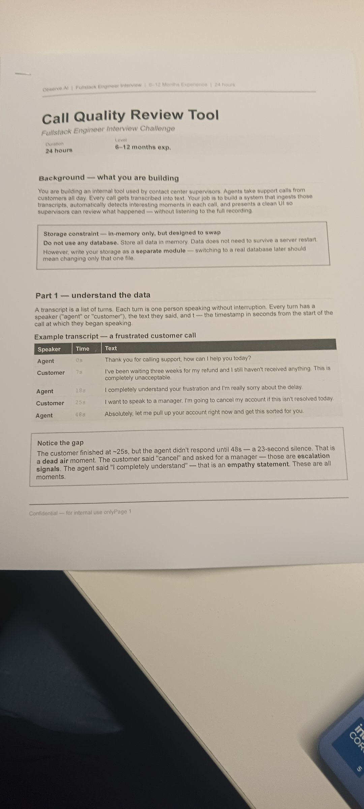
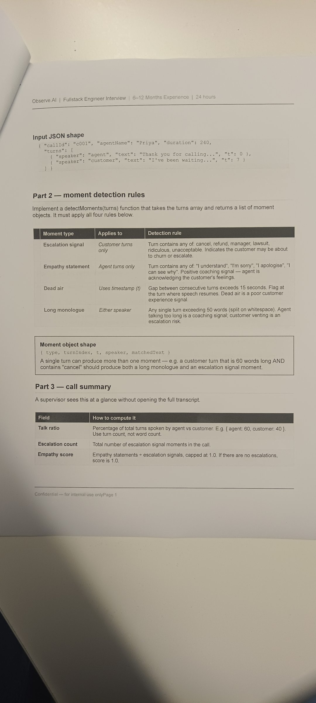
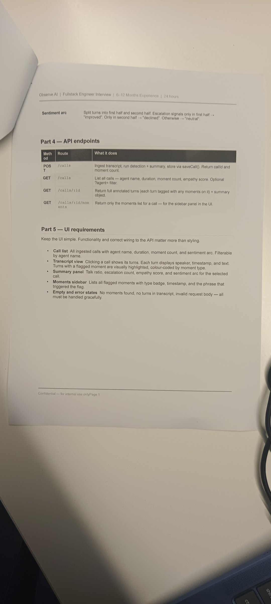
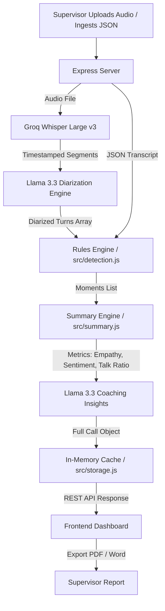

# 🎧 Call Quality Review Tool — AI-Powered Voice Analytics

An enterprise-grade **AI-powered Call Quality Review & Analytics Dashboard** designed for contact center supervisors. This tool automates the auditing process by combining state-of-the-art automatic speech recognition (ASR), LLM-based speaker diarization, deterministic conversational pattern checking, and generative coaching feedback into a unified, high-performance web application.

This repository was created as an official submission for the **Observe.ai Hackathon 2026 (Round 2 — Agentic AI Challenge)**.

---

## 📸 Application Screenshots

Below are screenshots of the running Call Quality Review Tool, showcasing the dashboard, analytics modules, and the interactive transcript viewer.

| 1. Dashboard Overview & Analytics | 2. Transcribed Transcript & Moments | 3. Credits & Technical Specs |
| :---: | :---: | :---: |
|  |  |  |

---

## ✨ Key Features

### 1. Diarized Voice Intelligence Pipeline
* **Automatic Speech Recognition:** Processes audio file uploads (MP3, WAV, M4A, etc.) through **Groq Whisper Large v3** to produce segment-level transcriptions with timestamps.
* **Contextual Diarization:** Uses **Llama 3.3** to analyze transcription segments and intelligently attribute them to the `agent` or the `customer` based on linguistic context (greetings, professional framing, complaints, and conversational flow).

### 2. Rule-Based Moment Detection Engine
Processes turns instantly using localized string validation and math logic:
* 🔴 **Escalation Signals (Customer):** Flags turns containing high-friction keywords (`cancel`, `refund`, `manager`, `lawsuit`, `ridiculous`, `unacceptable`).
* 💚 **Empathy Statements (Agent):** Identifies agent validation phrases (`understand`, `sorry`, `apologize`, `apologise`, `i can see why`).
* ⏸️ **Dead Air:** Measures transitions and flags gaps of silence exceeding **15 seconds** between turns.
* 📢 **Long Monologues:** Identifies any speaker turn exceeding **50 words**, signaling over-explaining or excessive complaints.

### 3. Quantitative Summary Metrics
* **Empathy Score:** Calculates the ratio of agent empathy statements to customer escalations (normalized to a maximum of `1.00`).
* **Sentiment Arc:** Evaluates the conversation trajectory (`improved`, `declined`, or `neutral`) based on where escalations occur (first half vs. second half).
* **Talk Ratio:** Compares turn-based speech distribution between the agent and customer.

### 4. Generative AI Coaching Insights
* Generates concise, actionable 3-5 bullet point coaching notes for supervisors using **Llama 3.3**, focusing on agent strengths, areas of improvement, and concrete training suggestions.

### 5. Native Document Export Suite
* **PDF Reports:** Opens a clean print-ready window with custom CSS print stylesheets, letting supervisors print or save reports directly.
* **Word Documents (.doc):** Generates well-formatted HTML-wrapped Word reports dynamically, allowing direct download and native import into Microsoft Word.

### 6. Premium Cyberpunk-Glassmorphism UI
* Built with a cohesive dark cyberpunk aesthetic featuring background blur, glow colors, and smooth micro-interactions.
* **3D Hover-Tilt Cards:** Metric cards tilt dynamically in 3D space when hovered, utilizing high-performance event delegation on `document.body`.
* **Spotlight Shines & Skeletons:** Features glowing layout grids and active shimmer skeletons while loading transcripts.

---

## 🛠️ Technology Stack

* **Frontend:** Vanilla HTML5, CSS3 (Glassmorphism theme system, custom variables, keyframe animations), Vanilla JavaScript (state management, DOM renderer, event handlers).
* **Backend:** Node.js, Express.js (REST API server), Multer (multipart form-data handling).
* **AI Orchestration:** Groq SDK for Node.js (`whisper-large-v3-turbo` for ASR, `llama-3.3-70b-versatile` for speaker diarization and coaching insights).

---

## 📐 System Architecture

The following diagram illustrates the workflow of the Voice Intelligence Pipeline from audio upload to visual reporting:



---

## 🚀 Installation & Local Setup

### Prerequisites
* [Node.js](https://nodejs.org/) (v16 or higher)
* A [Groq API Key](https://console.groq.com/) for speech-to-text and LLM operations.

### Setup Instructions

1. **Clone the Repository:**
   ```bash
   git clone https://github.com/shubha9696/call-quality-review.git
   cd call-quality-review
   ```

2. **Install Dependencies:**
   ```bash
   npm install
   ```

3. **Configure Environment Variables:**
   Create a `.env` file in the root directory and add your Groq API key:
   ```env
   GROQ_API_KEY=gsk_your_actual_groq_api_key_here
   PORT=3000
   ```

4. **Start the Development Server:**
   ```bash
   npm run dev
   ```
   The server will start, and the application will be accessible at:
   **`http://localhost:3000`**

---

## 🔌 REST API Specifications

The Express backend exposes the following endpoints:

### 1. Ingest JSON Transcript
* **Endpoint:** `POST /calls`
* **Content-Type:** `application/json`
* **Request Body:**
  ```json
  {
    "id": "call_101",
    "agentName": "Alice Johnson",
    "timestamp": "2026-06-20T12:00:00Z",
    "duration": 120,
    "transcript": [
      { "speaker": "agent", "text": "Thank you for calling. How can I help you?", "t": 0 },
      { "speaker": "customer", "text": "I need to cancel my account. This service is ridiculous.", "t": 10 }
    ]
  }
  ```
* **Response:** `201 Created`
  ```json
  {
    "callId": "call_101",
    "momentCount": 1
  }
  ```

### 2. Upload Audio File
* **Endpoint:** `POST /calls/upload`
* **Content-Type:** `multipart/form-data`
* **Form Parameters:**
  * `audio`: Binary audio file (MP3, WAV, M4A, FLAC, etc. Max 25MB).
  * `agentName`: Name of the agent (optional, defaults to "Unknown Agent").
  * `id`: Custom call ID (optional).
* **Response:** `201 Created`
  ```json
  {
    "callId": "call_1466487192",
    "momentCount": 4,
    "turnCount": 12,
    "duration": 182,
    "source": "audio"
  }
  ```

### 3. List All Calls
* **Endpoint:** `GET /calls`
* **Query Parameters:** `?agent=Alice` (optional filter)
* **Response:** `200 OK`
  ```json
  [
    {
      "id": "call_101",
      "agentName": "Alice Johnson",
      "timestamp": "2026-06-20T12:00:00Z",
      "duration": 120,
      "momentCount": 1,
      "empathyScore": 0.0,
      "sentimentArc": "neutral",
      "source": "json"
    }
  ]
  ```

### 4. Fetch Full Call Details
* **Endpoint:** `GET /calls/:id`
* **Response:** `200 OK`
  Returns the complete call object containing the annotated transcript turns, summary metrics, moments list, and AI-generated insights.

### 5. Delete Call Recording
* **Endpoint:** `DELETE /calls/:id`
* **Response:** `200 OK`
  ```json
  {
    "success": true,
    "message": "Call \"call_101\" deleted successfully."
  }
  ```

---

## 👥 Credits & Hackathon Submission

This platform was architected and developed by:

* **Lead Architect:** **Shubham Chakrawarti**
  * **Role:** AI/ML Systems Engineer & Full Stack Software Developer
  * **Location:** Bengaluru, India
  * **Education:** B.Tech in Computer Science & Engineering (Artificial Intelligence) — Parul University
  * **Contact:** [shubham2004.hc@gmail.com](mailto:shubham2004.hc@gmail.com) | +91 9696137126
  * **Links:** [LinkedIn Profile](https://linkedin.com/in/shubham-chakrawarti-27764836a) | [GitHub Profile](https://github.com/shubh9696)
  * **Core Stack:** Python, TensorFlow, Scikit-Learn, SQL, MongoDB, Docker, Node.js, Express, CI/CD, AWS/Azure.

* **Challenge Issuer:** **Observe.ai**
  * Built to demonstrate production-grade voice intelligence engineering, custom speaker diarization heuristics, and responsive client-side visual telemetry.
